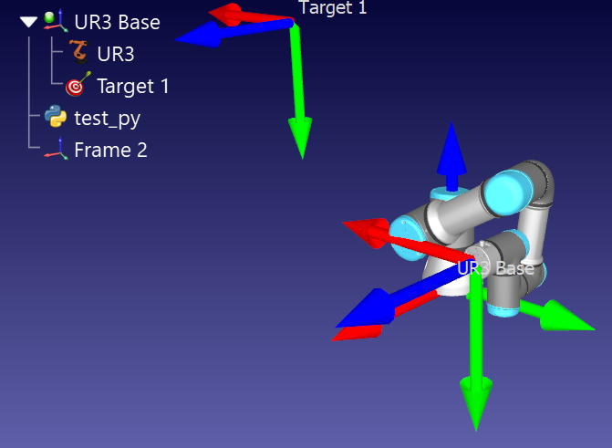

# UDP_with_ROBO_DK
## Sending info to ROBO_DK via UDP communication
This 1st project consists in the communication between a Python server and a [ROBO_DK Simulation](https://robodk.com/) via the UDP protocol. Implementation of a UDP socket in Python to communicate between the user and the RoboDK interface. 

You can see 2 Python scripts:
- **PC_UDP_socket**: It sends from the PC server to the RoboDK client the desired radius dimension as a byte object. The user chooses the data to be sent and then by using a UDP protocol, we are able to send this packet to the RoboDK interface.
- **RoboDK_UDP_socket**: First of all, the robot moves from its current location to Target1 and then it waits for the user to send the radius by using the “PC_UDP_socket.py” script. Then it receives the radius and it draws the polygon according to the sent radius. Finally, it replies back to the server to inform that the data has been properly received.

## Sending the info from the LEAP MOTION device to ROBO_DK via UDP communication
This 2nd project consists in sending the coordinates from a [Leap Motion](https://www.ultraleap.com/) device to move the End-Effector of a Robot simulation with [ROBO_DK Simulation](https://robodk.com/), using the UDP protocol communication. 

You can also see 3 scripts:
- **test_py.py**: The roboDK python file that receives the data from the Leap Motion
- **02-multi-device.cpp**: The [Chai3d](https://www.chai3d.org/) adapted code, modified to send the coordinates of the hand to the simulation.
- **lab5.rdk**: This is the defined environment in RoboDK that allows the communication and presents the results.

